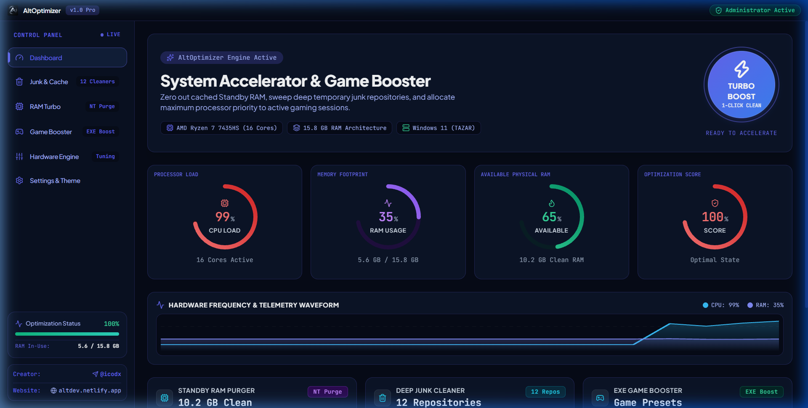
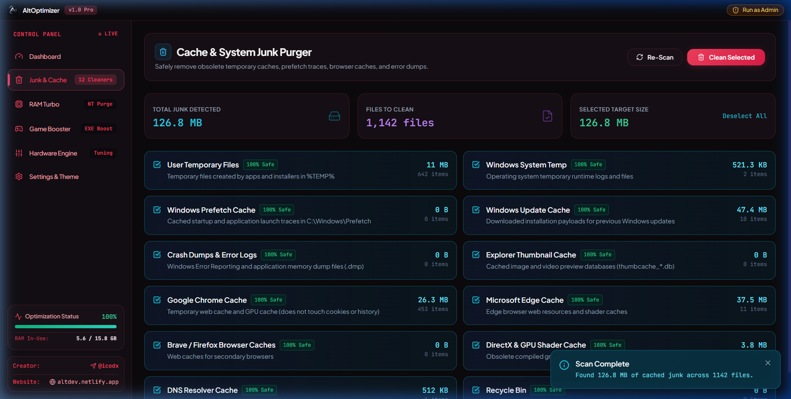
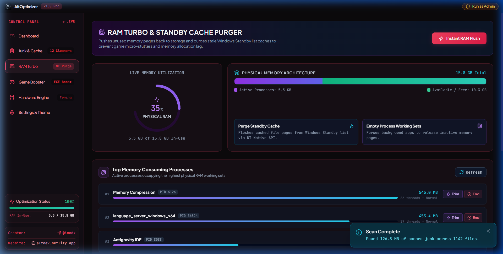
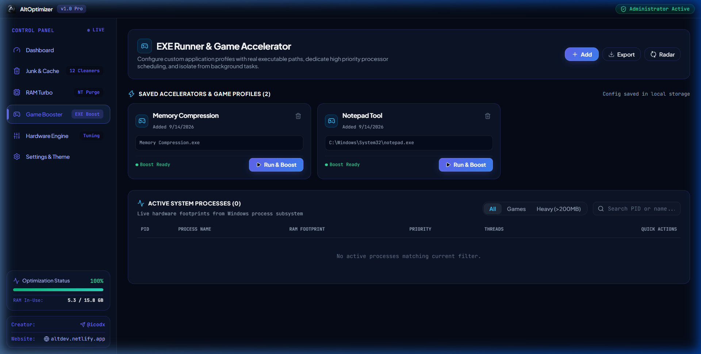
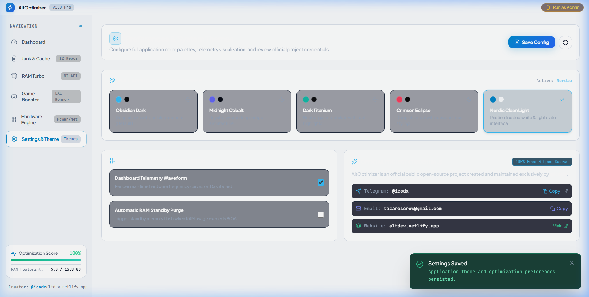

<div align="center">


# ⚡ AltOptimizer

**The Ultimate Open-Source Windows System Accelerator, Deep Cache Purger & EXE Game Booster**

[](https://github.com/)
[](LICENSE)
[](https://nodejs.org/)
[](https://dotnet.microsoft.com/)
[](https://t.me/icodx)
[](https://altdev.netlify.app)
[](https://microsoft.com/windows)

---

### 👑 Project Ownership & Official Contacts
**AltOptimizer is an official 100% Free & Open-Source Public Project.**  
The sole author, creator, and owner of this project is **@icodx**.

- 📬 **Telegram**: [@icodx](https://t.me/icodx)
- 📧 **Official Email**: [tazarescrow@gmail.com](mailto:tazarescrow@gmail.com)
- 🌐 **Developer Website**: [altdev.netlify.app](https://altdev.netlify.app)

---

### ⚡ Complete 1-Click Auto Setup (Installs Everything)
> **Brand new machine or don't have Node.js / npm / .NET installed?**
>
> # 👉 Double-Click `setup.bat` 👈
>
> 🪄 **Automatic All-in-One Installer**: Automatically requests Administrator privileges, detects and installs **Node.js LTS**, installs **Microsoft .NET 9 SDK**, runs `npm install`, verifies the native C# engine, and gets everything 100% ready in one click!

---

### 🚀 1-Click Fast Launch (Once Installed)
> **To start AltOptimizer directly at any time, simply double-click:**
>
> # 👉 `launch-desktop.bat` *(or `launch.bat`)* 👈
>
> 🛡️ **Automatic Administrator Elevation**: You do **not** need to right-click or manually select *"Run as administrator"*. Windows will automatically prompt you with the standard UAC elevation dialog. Click **Yes**, and AltOptimizer launches instantly with full native NT kernel optimization privileges!

---

</div>

## 📑 Table of Contents
- [🌟 Overview](#-overview)
- [💻 System Requirements](#-system-requirements)
- [⚡ 1-Click Automated Setup (`setup.bat`)](#-1-click-automated-setup-setupbat)
- [⌨️ 1-Line PowerShell Command](#️-1-line-powershell-command-for-power-users)
- [📋 Prerequisites (Node.js, npm & .NET 9)](#-prerequisites-manual-installation)
  - [1. Node.js & npm](#1-nodejs--npm-runtime)
  - [2. Microsoft .NET 9 SDK](#2-microsoft-net-9-sdk--runtime)
- [🛠️ Manual Setup & Developer Guide](#️-manual-setup--developer-guide)
- [📸 Software Previews & Screenshots](#-software-previews--screenshots)
- [🚀 Key Modules & Architecture](#-key-modules--architecture)
- [❓ Troubleshooting & FAQ](#-troubleshooting--faq)
- [🛡️ Open Source License](#-open-source-license)

---

## 🌟 Overview

**AltOptimizer** is a transparent, modern, and ultra-fast Windows PC optimization suite engineered specifically for competitive gamers, power users, and developers. 

Unlike commercial PC cleaners that install background bloatware or nag you with paywalls, **AltOptimizer is 100% free, public, and open-source**. It interfaces directly with Windows Win32 and native NT kernel APIs to reclaim memory, eliminate input lag, and squeeze maximum FPS out of your hardware.

---

## 💻 System Requirements

| Component | Minimum Specification | Recommended |
| :--- | :--- | :--- |
| **Operating System** | Windows 10 64-bit (Build 1809+) | Windows 10 / 11 64-bit (Latest Build) |
| **Architecture** | x64 (64-bit Intel / AMD) | x64 (64-bit Intel / AMD) |
| **JavaScript Runtime** | Node.js v18+ (includes `npm`) | **Node.js v20+ or v22+ LTS** |
| **.NET Runtime** | .NET 9 Desktop Runtime / SDK | **Microsoft .NET 9.0 SDK** |
| **Pre-compiled Engine** | Pre-compiled `bin/MemoryEngine.exe` included | .NET 9 SDK *(to rebuild native code)* |
| **User Privileges** | Administrator (Required for NT Standby Purge & Latency Tweaks) | Self-elevating via `launch-desktop.bat` |

---

## ⚡ 1-Click Automated Setup (`setup.bat`)

The easiest way to get started on Windows without manually downloading anything:

1. Download or clone this repository to your PC.
2. **Double-click [`setup.bat`](setup.bat)** in the root folder.
3. Click **Yes** on the Windows UAC Administrator prompt.
4. Sit back! The script will dynamically inspect each component and **only install what is missing**:
   - 🔍 **Checks Node.js & npm**: If already installed, it reports `[STATUS] AVAILABLE` and skips it. If not found, it automatically downloads and installs **Node.js LTS** via `winget`.
   - 🔍 **Checks Microsoft .NET 9 SDK**: If already installed, it reports `[STATUS] AVAILABLE` and skips it. If not found, it downloads and installs **.NET 9 SDK** via `winget`.
   - 🔍 **Checks Dependencies (`node_modules`)**: If already present, skips reinstalling. If missing, runs `npm install` automatically.
   - 🔍 **Checks Native Memory Engine**: Verifies `bin/MemoryEngine.exe`; compiles it if missing.
   - 🚀 Asks if you want to immediately launch AltOptimizer!

---

## ⌨️ 1-Line PowerShell Command (For Power Users)

If you prefer using **PowerShell (Run as Administrator)** or Windows Terminal, you can copy-paste this single one-line command to install Node.js, .NET 9 SDK, and all project packages at once:

```powershell
winget install --id OpenJS.NodeJS.LTS -e --accept-package-agreements --accept-source-agreements; winget install --id Microsoft.DotNet.SDK.9 -e --accept-package-agreements --accept-source-agreements; npm install
```

> [!TIP]
> After running this command on a clean machine for the first time, close and reopen your terminal or reboot so Windows loads your newly registered PATH environment variables.

---

## 📋 Prerequisites (Manual Installation)

If you prefer installing tools manually instead of using `setup.bat`:

### 1. Node.js & npm Runtime
Node.js powers the Electron desktop shell, local telemetry server, and front-end interface. The `npm` package manager comes bundled with Node.js.

* **Option A (Terminal via winget)**:
  ```powershell
  winget install OpenJS.NodeJS.LTS
  ```
* **Option B (Official GUI Installer)**:
  1. Visit **[https://nodejs.org/](https://nodejs.org/)** and download the **LTS (Recommended for Most Users)** Windows `.msi` installer.
  2. Run the installer, keep default settings, and ensure **"Add to PATH"** is selected.
* **Option C (Chocolatey / Scoop)**:
  ```bash
  choco install nodejs-lts    # Chocolatey
  scoop install nodejs-lts    # Scoop
  ```

**Verify Node & npm**:
```bash
node -v
npm -v
```

---

### 2. Microsoft .NET 9 SDK / Runtime
The high-performance standby memory purge engine (`engine/native/MemoryEngine.csproj`) is written in C# and targets **.NET 9.0**.

> [!NOTE]
> A pre-compiled binary (`bin/MemoryEngine.exe`) is already included in this repository so you can run the app immediately. Installing the .NET 9 SDK ensures full runtime library compatibility and enables you to recompile native kernel tweaks from source.

* **Option A (Terminal via winget)**:
  ```powershell
  winget install Microsoft.DotNet.SDK.9
  ```
* **Option B (Official GUI Installer)**:
  1. Visit **[https://dotnet.microsoft.com/download/dotnet/9.0](https://dotnet.microsoft.com/download/dotnet/9.0)**.
  2. Under **.NET SDK 9.x**, click **Windows x64 Installer**.
  3. Run the installer and complete the setup wizard.
* **Option C (Chocolatey / Scoop)**:
  ```bash
  choco install dotnet-sdk    # Chocolatey
  scoop install dotnet-sdk    # Scoop
  ```

**Verify .NET**:
```bash
dotnet --version
```
*(Should output `9.0.xxx`)*

---

## 🛠️ Manual Setup & Developer Guide

If setting up via the command line:

```bash
# 1. Clone repository
git clone https://github.com/SudoAltDev/Optimizer.git
cd Optimizer

# 2. Install dependencies
npm install

# 3. (Optional) Rebuild the native C# Memory Engine from source
npm run build:native

# 4. (Optional) Build frontend production distribution
npm run build

# 5. Launch AltOptimizer
# Method A: Double-click launch-desktop.bat (or launch.bat)
# Method B: Run through terminal
npm run app
```

---

## 📸 Software Previews & Screenshots

<div align="center">

### ⚡ 1. Live Telemetry Dashboard & 1-Click Master Boost
*Real-time SVG waveform telemetry, dynamic health rating, hardware specs radar, and unified one-click master optimization.*



<br/><br/>

### 🧹 2. Deep 12-Repository Junk & Cache Sweeper
*Cleans GPU shader caches (DirectX, NVIDIA, AMD), Windows Prefetch, update installer residue, crash dumps, and browser temp without touching passwords or cookies.*



<br/><br/>

### 🧠 3. RAM Turbo & Top Memory Processes Radar
*Direct Windows NT kernel standby cache purger (`NtSetSystemInformation`), working set trimmer, and live inspection of memory-heavy apps with 1-click RAM trimming.*



<br/><br/>

### 🎮 4. Dedicated Game Booster & EXE Turbo Runner
*Launch any executable (`.exe`) with pre-boosted physical RAM, High Priority scheduling, and background app suppression. Includes verified presets for top competitive games.*



<br/><br/>

### 🎨 5. Theme Studio & Real Preset Configuration
*Modern sleek visual themes (Cyber Neon Cyan, Toxic Emerald, Midnight Stealth, Vapor Wave), custom refresh intervals, and custom preset save engine.*



</div>

---

## 🚀 Key Modules & Architecture

### 1. ⚡ Dashboard & 1-Click Master Turbo Boost
- **One-Click Master Sweep**: Simultaneously cleans safe temp caches, flushes NT Standby RAM, empties background working sets, flushes DNS, and applies the Ultimate Performance power plan.
- **Dynamic Real-Time Waveform**: Live SVG wave visualizer tracking CPU and RAM load fluctuations over time.
- **Hardware Rig Specs**: Detects CPU architecture, active core count, total physical RAM, and OS build info.

### 2. 🎮 Game Booster & EXE Runner
- **Direct EXE Runner**: Select any game or application executable (`.exe`) to launch with pre-boosted physical RAM, High Priority scheduling, and background app suppression.
- **Popular Game Presets**: One-click shortcuts for Valorant, Counter-Strike 2, Fortnite, Minecraft, Grand Theft Auto V, and League of Legends.
- **Active Process Radar**: Real-time process inspector displaying PID, RAM usage, CPU time, priority class, and thread counts with instant `Boost` and `Kill` actions.

### 3. 🧠 RAM Turbo & NT Standby Purger
- **Win32 NT Kernel Integration**: Directly invokes `NtSetSystemInformation(SYSTEM_MEMORY_LIST_INFORMATION)` and `EmptyWorkingSet`.
- **Standby Memory Purging**: Eliminates micro-stutters and frame drops caused by Windows caching files in memory that must be evicted when games demand RAM.
- **Top RAM Consumers Radar**: Displays active memory-hogging processes with real-time memory meters and 1-click process trimming.

### 4. 🧹 12-Category Deep Cache & Junk Cleaner
- **User & Windows Temp**: Cleans `%TEMP%` and `C:\Windows\Temp`.
- **System Prefetch & Update Cache**: Removes obsolete installation payloads.
- **Browser Caches**: Cleans Chrome, Edge, Brave, and Firefox caches without deleting cookies, bookmarks, or saved passwords.
- **DirectX & GPU Shader Cache**: Purges outdated compiled shader blobs (DirectX, NVIDIA, AMD) to resolve shader stutter.
- **Crash Dumps & Error Reports**: Reclaims gigabytes of disk space from Windows error reports.

### 5. 🛠️ Hardware Engine & Gaming Latency Tweaks
- **Ultimate Performance Scheme**: Unlocks the hidden OEM power scheme to eliminate core parking and CPU throttling.
- **Gaming Latency & Telemetry Suppressor**: Disables the 20% multimedia CPU reserve (`SystemResponsiveness = 0`), unlocks unlimited network packet throughput (`NetworkThrottlingIndex = 0xFFFFFFFF`), and suspends `DiagTrack` telemetry.
- **Network TCP Auto-Tuning**: Sets TCP auto-tuning to normal for full bandwidth utilization and flushes DNS.

### 6. 🎨 Themes & Custom Configuration
- Switch seamlessly between curated palettes: **Cyber Neon (Cyan)**, **Toxic Matrix (Emerald)**, **Vapor Wave (Purple)**, **Crimson Redline**, and **Midnight Stealth**.
- Clean, readable typography using **Plus Jakarta Sans** and **Inter**.
- Add custom game shortcuts and persist them to local configuration.

---

## ❓ Troubleshooting & FAQ

<details>
<summary><b>1. Error: <code>'npm' or 'node' is not recognized as an internal or external command</code></b></summary>
<br/>

**Cause**: Node.js is either not installed or your system `PATH` hasn't reloaded yet.  
**Solution**:
1. Simply double-click [`setup.bat`](setup.bat) to install Node.js automatically!
2. Or run `winget install OpenJS.NodeJS.LTS` manually in PowerShell.
3. Close and reopen your terminal / command prompt so Windows reloads the environment PATH.
</details>

<details>
<summary><b>2. Error: <code>'dotnet' is not recognized as an internal or external command</code></b></summary>
<br/>

**Cause**: .NET 9 SDK is not installed on your system.  
**Solution**:
1. Double-click [`setup.bat`](setup.bat) or run `winget install Microsoft.DotNet.SDK.9` in PowerShell.
2. Note that `bin/MemoryEngine.exe` is already pre-compiled, so this is only required if you run `npm run build:native`.
</details>

<details>
<summary><b>3. Why does AltOptimizer request Administrator privileges upon launch?</b></summary>
<br/>

**Answer**: Standard Windows user processes cannot flush the kernel-level Standby List (`NtSetSystemInformation`), adjust system power profiles, or optimize process priorities across all subsystems. Administrator privileges ensure that AltOptimizer can directly interact with these low-level Win32 NT APIs to provide genuine hardware acceleration.
</details>

<details>
<summary><b>4. The launcher window opens and immediately closes. What happened?</b></summary>
<br/>

**Cause**: You have not run `npm install` yet, or Node.js is missing.  
**Solution**:
1. Double-click [`setup.bat`](setup.bat) to automatically install missing dependencies.
2. Once complete, launch via `launch-desktop.bat`.
</details>

<details>
<summary><b>5. Will cleaning browser caches log me out or delete my passwords?</b></summary>
<br/>

**Answer**: **No.** AltOptimizer's browser cleaner specifically targets temporary disk cache files (e.g. `Cache_Data`, cached images, and stale scripts). It deliberately ignores your SQLite login databases, `Cookies`, `History`, and saved form data.
</details>

<details>
<summary><b>6. Is AltOptimizer safe? Does it contain telemetry or ads?</b></summary>
<br/>

**Answer**: AltOptimizer is **100% free and open-source**. There are zero third-party ads, tracking SDKs, or paywalls. You can inspect every line of source code directly in this repository.
</details>

---

## 🛡️ Open Source License

This project is licensed under the **MIT License** ([LICENSE](LICENSE)).  
You are completely free to use, modify, study, fork, and distribute this software.

Copyright (c) 2026 **@icodx** ([altdev.netlify.app](https://altdev.netlify.app)).
